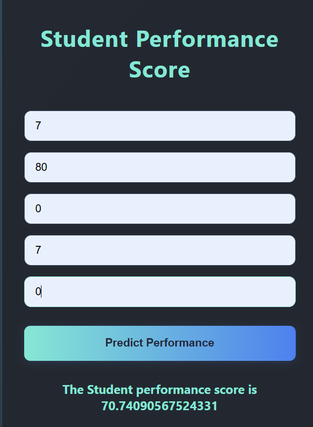

# 🎓 Student Performance Indicator


[](https://testforestfires-dyi0.onrender.com/predict_data)
[](https://www.python.org/)
[](https://flask.palletsprojects.com/)


A machine learning-based web application built with Flask to **predict a student's performance score** based on multiple academic and behavioral factors like study hours, sleep hours, past scores, etc.

> 🚀 Live Demo: [Click here to try](https://studentent-performance-prediction.onrender.com)

---

## 📸 Preview



---

## 🧠 Features

- 📊 Predicts a student's performance score using Ridge Regression.
- 📝 Input fields for:
  - Hours Studied
  - Previous Scores
  - Extracurricular Activities (0=No, 1=Yes)
  - Sleep Hours
  - Sample Question Papers Practiced
- 🎨 Stylish, dark-themed UI using HTML & CSS.
- 🔁 Real-time prediction (Flask-powered).

---

## 📦 Tech Stack

| Technology | Description |
|------------|-------------|
| `Python`   | Core language |
| `Flask`    | Backend web framework |
| `HTML/CSS` | Frontend |
| `Sklearn`  | Ridge Regression Model |
| `Render`   | Deployment |

---

## 🔢 How It Works

1. The user fills in academic metrics.
2. Inputs are scaled using `StandardScaler`.
3. Ridge Regression model predicts the performance score.
4. Result is displayed below the form dynamically.

---

## 🚀 Run Locally

Clone the project:

```bash
git clone https://github.com/mayank-kumar03/Studentent_performance_prediction

cd Student_Performance
```

## 📁 Project Structure
```
Student_Performance_Indicator/
├── models/
│   ├── model.pkl
│   └── scaler.pkl
├── templates/
│   ├── index.html
│   └── predict.html
├── application.py
├── requirements.txt
└── image.png
```

## 🧠 Model Info
The prediction model was trained using Ridge Regression, which is effective for multicollinearity and prevents overfitting.

## 🙌 Author
Made with ❤️ by Mayank Kumar

## ⭐ Feedback
If you found this project helpful or interesting, please consider giving it a ⭐ on GitHub. Your support motivates me to keep building cool stuff!